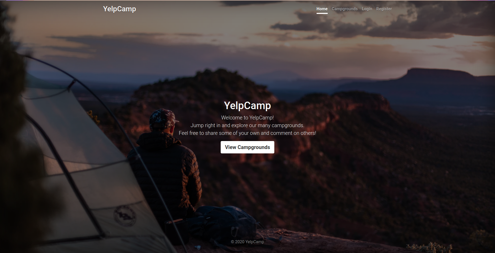

# YelpCamp

Live app: [mehdi-yelp-camp.herokuapp.com](https://mehdi-yelp-camp.herokuapp.com)  
**It might take a few seconds for the dyno to wake up**



---

I followed along [The Webdeveloper Bootcamp](https://www.udemy.com/course/the-web-developer-bootcamp/) to build YelpCamp project.

# Backend
* The backend server is hosted in Heroku
* The database is hosted in MongoDB Atlas
* Images are hosted by Cloudinary
* Technologies:
  + node.js
  + joi: validation
  + mongoose: connect to MongoDB
  + multer: to automatically parse form data and upload images
  + passport: for local authentication
  + dotenv: for parsing .env files
# Frontend
* The frontend is served by the backend server
* It is templated using EJS on the server
* It uses Bootstrap v5
* Technologies:
  + mapbox: for map components
  + ejs: for templating
  + ejs-mate: for boilerplate layout
# Get started
1. Download or clone the repo
2. Install modules

```bash
npm install
```

3. Provide required environment variables: Fill the .env.template file and rename it to .env
4. Run in development mode

```
nodemon app.js
```
